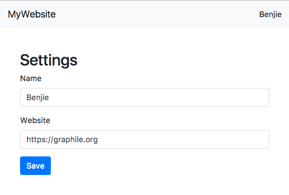
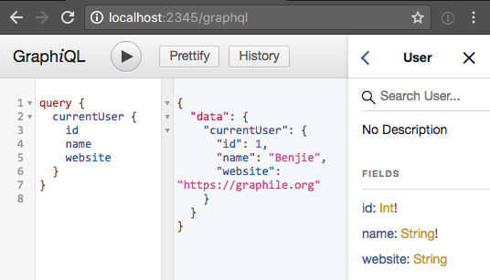

class: title-page bg-blue-home

# Lightweight GraphQL

### Benjie Gillam (@Benjie)

GraphQL Trainer  
[PostGraphQL](https://github.com/postgraphql/postgraphql) OSS maintainer

.slidesLocation[

Follow along at [https://is.gd/lightweight_graphql_talk](https://is.gd/lightweight_graphql_talk)
]

???

Hello everyone I'm Benjie Gillam.

I'm a freelance software developer, working on Postgres, Node.js, GraphQL and
React projects.

I'm also a GraphQL trainer and the maintainer of the open source PostGraphQL
project which **allows you to create a full GraphQL API from your Postgres
database schema in a instant - you should check it out!**

But I'm not going to be talking about that today; instead we're going to be
talking about how to make a lightweight GraphQL app.

---

class: chapter-title center middle

# Lightweight?

.slidesLocation[
Follow along at [https://is.gd/lightweight_graphql_talk](https://is.gd/lightweight_graphql_talk)
]

---
class: bg-white

## What's not discussed:

.slidesLocation[
Follow along at [https://is.gd/lightweight_graphql_talk](https://is.gd/lightweight_graphql_talk)
]

???

So what do I mean by a lightweight GraphQL app? Well we won't be using using
any of the GraphQL tooling such as Apollo or Relay. We won't be using
JavaScript tooling such as webpack or browserify. We will not be delving into the
server side.

We will just be using vanilla JS, window.fetch() and of course react!

--

- ❎ GraphQL tooling
--

- ❎ JavaScript tooling
--

- ❎ Delving into the server-side
--


# 


## What is discussed:
--

- ✅ Vanilla JS
--

- ✅ window.fetch()
--

- ✅ React

---
class: invert center


.fire[

# DISCLAIMER

]

.slidesLocation[
Follow along at [https://is.gd/lightweight_graphql_talk](https://is.gd/lightweight_graphql_talk)
]

???

Before we get started a little disclaimer:


--

## This talk does not demonstrate best practices!


???

What I will be showing you does not demonstrate best practices!


--

.smallprint[
Examples in this talk and the associated GitHub repository have been
deliberately simplified to ease understanding. GraphQL tooling does a lot for
you and you should embrace it in any GraphQL projects you work on; however
trying to master the tooling at the same time as the new query language can
cause headaches, stress, feelings of being overwhelmed and in some extreme
cases desk inversion. Terms and conditions apply; see in-store for details.
Nullam ac lectus at neque convallis tempus. Nam augue
risus, hendrerit vel ligula sed, sagittis pretium felis. Aenean vitae ipsum nec
nisl faucibus venenatis. Sed sed blandit diam. Quisque et nunc vel orci
sollicitudin vestibulum. Donec tempor felis nec mauris fermentum, id placerat
lorem luctus.

]

???

We are deliberately not using the GraphQL tooling because we want to understand
what is going on under the hood.

It's important to recognise that you SHOULD use GraphQL tooling in your
production projects as it will save you a lot of work and hopefully reduce
the number of errors.

So without further ado let's get started

---
class: bg-blue center

## What the designers want:



???

Here is the specification that has been given to our team.

It's a fairly simple settings page with a header displaying the website name
and the name of the user that is currently logged in,

and a form allowing the user to edit their name and website.


---
class: chapter-title center middle

# Step 1: Mock-up

???

The first thing we going to do is building a mock-up.


---
class: has-code

### Basic HTML setup:

```html
<!DOCTYPE html>
<html>
  <head>
    <title>Lightweight GraphQL Example</title>
    <meta http-equiv="Content-Type" content="text/html; charset=UTF-8"/>
*   <link type='text/css' rel='stylesheet' href='css/bootstrap.min.css' />
  </head>
  <body>
    <div id='react'></div>
*   <script type="application/javascript" src="react.min.js"></script>
*   <script type="application/javascript" src="react-dom.min.js"></script>
*   <script type="application/javascript" src="babel.min.js"></script>
*   <script type="text/babel" src="main.js"></script>
  </body>
</html>
```

???

Here is the basic HTML file that we are going to use.

First we're using the bootstrap CSS so we don't have to worry about stylesheets.

Then we are pulling in react and react DOM.

And since JSX is not built into the JavaScript language will also be pulling in
Babel so that the browser can understand this syntax.

And that's the extent of the tooling we'll be using.

Finally we load our main javascript file.

---
class: has-code

.contextImage[

]

???
So moving the spec image to the side...


--
#### Backend engineers have provided mock data:

```js
const MOCK_DATA = {
  currentUser: {
    name: 'Benjie',
    website: 'https://graphile.org',
  },
};
```

???

The backend engineer has provided us with the following mock data.

As you can see it's simply a currentUser object which includes name and website
fields.


---
class: has-code has-code-extra-space

.contextImage[


.context[
```js
const MOCK_DATA = {
  currentUser: {
    name: 'Benjie',
    website: 'https://graphile.org',
  },
};
```
]
]

???
Moving this to the side...

--


```js
const Header = ({currentUser}) =>
  <nav>
    <a href='/'>MyWebsite</a>
    <a>{currentUser.name}</a>
  </nav>;
```

???

We will start to mock out our react application.

First we have the header with the website name on the left and the current
username on the right.

---
class: has-code has-code-extra-space

.contextImage[


.context[
```js
const MOCK_DATA = {
  currentUser: {
    name: 'Benjie',
    website: 'https://graphile.org',
  },
};
```


```js
const Header = ({currentUser}) =>
  <nav>
    <a href='/'>MyWebsite</a>
    <a>{currentUser.name}</a>
  </nav>;
```
]
]

???

Moving this to the side also...

--

```js
class SettingsPage extends React.Component {
  ...
  render() {
    return <form onSubmit={this.onSubmit}>
      <h2>Settings</h2>
      <label>Name <input ... /></label>
      <label>Website <input ... /></label>
      <button>Save</button>
    </form>;
  }
}
```

???

We then have the main settings page area that is a form containing the name and
website inputs and a save button.

---
class: has-code has-code-extra-space


.contextImage[


.context[
```js
const MOCK_DATA = {
  currentUser: {
    name: 'Benjie',
    website: 'https://graphile.org',
  },
};
```


```js
const Header = ({currentUser}) =>
  <nav>
    <a href='/'>MyWebsite</a>
    <a>{currentUser.name}</a>
  </nav>;
```
]
]

.context[
```js
class SettingsPage extends React.Component {
  ...
  render() {
    return <form onSubmit={this.onSumbit}>
      <h2>Settings</h2>
      <label>Name <input ... /></label>
      <label>Website <input ... /></label>
      <button>Save</button>
    </form>;
  }
}
```
]
```js
const Layout = ({currentUser}) =>
  <div>
    <Header currentUser={currentUser} />
    <SettingsPage
      currentUser={currentUser} />
  </div>;
```

???

Pulling these together we have the Layout component which renders both the
Header and SettingsPage components passing down the currentUser.

---
class: has-code has-code-extra-space

.contextImage[


.context[
```js
const MOCK_DATA = {
  currentUser: {
    name: 'Benjie',
    website: 'https://graphile.org',
  },
};
```


```js
const Header = ({currentUser}) =>
  <nav>
    <a href='/'>MyWebsite</a>
    <a>{currentUser.name}</a>
  </nav>;
```
]
]

.context[
```js
class SettingsPage extends React.Component {
  ...
  render() {
    return <form onSubmit={this.onSumbit}>
      <h2>Settings</h2>
      <label>Name <input ... /></label>
      <label>Website <input ... /></label>
      <button>Save</button>
    </form>;
  }
}
```
```js
const Layout = ({currentUser}) =>
  <div>
    <Header currentUser={currentUser} />
    <SettingsPage
      currentUser={currentUser} />
  </div>;
```
]

```js
ReactDOM.render(
  <Layout {...MOCK_DATA} />,
  document.getElementById('react')
);
```

???

And finally we use ReactDOM.render to render the Layout to the webpage, passing
in our MOCK_DATA.

I will not be expanding any further on these react components as that is beyond
the scope of this talk.

---
class:  chapter-title center middle

# Step 2a: GraphQL

???

The backend engineer has got in touch and she has informed us that

**a basic read-only GraphQL API** is now available to us which

we should **use instead of the mock data** we were given before.

But before we can query this data we need to understand a little bit about
GraphQL.


---
class: has-code

### GraphQL returns data in shape you request.

???

The most fundamental thing to know about GraphQL is that it returns data in the
shape that you request.

For example to get the data that we had previously in our mock...

We would request the following...

As you can see the fields and structure in our query on the right correspond
with the fields and structure on the data returned on the left.


--

.leftSplit[
#### To get:

```json
{
  "currentUser": {
    "name": "Benjie",
    "website": "https://graphile.org"
  }
}
```
]

--
.rightSplit[
#### We request:

```graphql
{
  currentUser {
    name
    website
  }
}
```
]

---
class: has-code

### Anatomy of a GraphQL Query

```graphql
{
  currentUser {
    name
    website
  }
}
```

#### The query from the previous slide (above) has a few (nested) fields...

--

#### ...this structure is called a **"selection set"** and tells GraphQL exactly what data we want.


???

← ...

??

We omitted all the optional parts of the query above, so lets introduce some of
those back in.


---
class: has-code

### Anatomy of a GraphQL Query

```graphql
*query {
  currentUser {
    name
    website
  }
}
```

#### We can specify an **"operation type"** (in this case `query`)...

--

#### (Note: it's optional for queries but required for all other operation types such as `mutation`.)


---
class: has-code

### Anatomy of a GraphQL Query

```graphql
*query NameAndWebsiteQuery {
  currentUser {
    name
    website
  }
}
```

#### The **operation name** (`NameAndWebsiteQuery`) is an optional arbitrary name for the query.

#### It is useful for debugging.

???

← ...

??

 (It should not change the result of the query.)

??


Now imagine instead of wanting to view the current users name and website we
wanted to see someone else's.

---
class: has-code

### Anatomy of a GraphQL Query

```graphql
query NameAndWebsiteQuery {
* user(id: 1) {
    name
    website
  }
}
```

#### We can give a field additional data by passing it **arguments**.

#### Arguments can be required or optional.

???

**We need a way of specifying which user we want to look at**. We can do this
by passing arguments to the user field (or whichever field the backend engineer
has given us for this purpose).

Arguments can be required or optional, and they serve many purposes including
limiting and filtering lists of data, performing pagination, and as inputs to
mutations.

The issue with this query though is that we'd have to issue a different
(dynamic) query for each individual user profile we wished to see.


---
class: has-code

### Anatomy of a GraphQL Query

```graphql
*query NameAndWebsiteQuery($id: Int!) {
* user(id: $id) {
    name
    website
  }
}
```

???
The issue with this query though is that we'd have to issue a different
(dynamic) query for each individual user profile we wished to see.

**Instead** we can use GraphQL variables, similar to parameters in SQL queries, to extract these non-static arguments from the query string.

--

#### **Variables** (if any) are specified after the query name, and are referenced in the field arguments.


???

??

← ...

??

Because GraphQL is strongly typed, the type of the variable must be specified.


---
class: has-code

### Anatomy of a GraphQL Query

#### Recap:

```graphql
query NameAndWebsiteQuery($id: Int!) {
  user(id: $id) {
    name
    website
  }
}
```

```graphql
query                   # Operation type
NameAndWebsiteQuery     # Operation name, for debugging
($id: Int!)             # Variables and their types
{                       # Selection set
  user(id: $id)         # Field with arguments, variable reference
  {                     # Nested selection set
    name                # Field
    website
  }
}
```

???

So looking back at the full GraphQL query, we have:
- The operation **type**: query
- The operation **name**: NameAndWebsiteQuery
- The **variables**: $id of type non-null ID
- The **selection set** querying the user field on root passing the $id variable in as an argument
- The **nested selection set** of fields to request from the user object


---

class: bg-blue center middle


# Question!

### How do we know which operations are supported, or what fields we can query within those?


---

class: bg-blue center middle


# Answer!

### These questions and more are answered by the GraphQL schema.


---
class: has-code

## GraphQL Schema
--

#### The `schema` entry exposes available operations:


```graphql
schema {
⁣
⁣
⁣
}
```

???

The schema entry exposes available **operation types**

These include:

---
class: has-code

## GraphQL Schema

#### The `schema` entry exposes available operations:


```graphql
schema {
  query: ...
⁣
⁣
}
```
???

#### The schema entry exposes available operations.

These include:
- query for reading data
---
class: has-code

## GraphQL Schema

#### The `schema` entry exposes available operations:


```graphql
schema {
  query: ...
  mutation: ...
⁣
}
```
???

#### The schema entry exposes available operations.

These include:
- query for reading data
- mutation for writing/updating data
---
class: has-code

## GraphQL Schema

#### The `schema` entry exposes available operations:


```graphql
schema {
  query: ...
  mutation: ...
  subscription: ...
}
```
???

#### The schema entry exposes available operations.

These include:
- query for reading data
- mutation for writing/updating data
- subscription for being notified when events occur

---
class: has-code

## GraphQL Schema

.context[
#### The `schema` entry exposes available operations:


```graphql
schema {
  query: ...
  mutation: ...
  subscription: ...
}
```
]

#### Our read-only API only has the `query` operation; the fields of which are exposed on the `Query` type:

```graphql
schema {
* query: Query
}
```

???

← ...

??
---
class: has-code

## GraphQL Schema

.context[
```graphql
schema {
  query: Query
}
```
]

#### `Query` is the entry-point for reading data. It defines the fields available at the root level.
```graphql
type Query {
⁣
⁣
}
```

???
The Query type is the entry-point for reading data. It defines the fields available at the root level.

---
class: has-code

## GraphQL Schema

.context[
```graphql
schema {
  query: Query
}
```
]

#### `Query` is the entry-point for reading data. It defines the fields available at the root level.
```graphql
type Query {
  currentUser: ...
  user(id: Int!): ...
}
```

???

In our API we only have two root level fields currently: "currentUser" which
accepts no arguments, and "user" which accepts the integer ID of the user to
look up.


---
class: has-code

## GraphQL Schema

.context[
```graphql
schema {
  query: Query
}
```
]

```graphql
type Query {
  currentUser: ...
  user(id: Int!): ...
}
```

#### GraphQL is strongly-typed, so we must specify the type(s) each field can return.
---
class: has-code

## GraphQL Schema

.context[
```graphql
schema {
  query: Query
}
```
]

```graphql
type Query {
* currentUser: User
* user(id: Int!): User
}
```
#### GraphQL is strongly-typed, so we must specify the type(s) each field can return.

???

We're going to return a User type object from each of the two fields. And that User object is defined as follows:

---
class: has-code

## GraphQL Schema

.context[
```graphql
schema {
  query: Query
}
```
```graphql
type Query {
  currentUser: User
  user(id: Int!): User
}
```
]

#### GraphQL is strongly-typed, so we must specify the type(s) each field can return.

```graphql
type User {
⁣
⁣
⁣
}
```
---
class: has-code

## GraphQL Schema

.context[
```graphql
schema {
  query: Query
}
```
```graphql
type Query {
  currentUser: User
  user(id: Int!): User
}
```
]

#### GraphQL is strongly-typed, so we must specify the type(s) each field can return.
```graphql
type User {
  id: Int!
⁣
⁣
}
```

???

An 'id' field which is the integer primary key in our database and cannot be null - hence the bang(!)

---
class: has-code

## GraphQL Schema

.context[
```graphql
schema {
  query: Query
}
```
```graphql
type Query {
  currentUser: User
  user(id: Int!): User
}
```
]

#### GraphQL is strongly-typed, so we must specify the type(s) each field can return.
```graphql
type User {
  id: Int!
  name: String!
⁣
}
```

???

A 'name' field which is a string and also must not be null


---
class: has-code

## GraphQL Schema

.context[
```graphql
schema {
  query: Query
}
```
```graphql
type Query {
  currentUser: User
  user(id: Int!): User
}
```
]

#### GraphQL is strongly-typed, so we must specify the type(s) each field can return.
```graphql
type User {
  id: Int!
  name: String!
  website: String
}
```

???

A 'website' field which is a string but can be null

---
class: has-code

## GraphQL Schema

```graphql
schema {
  query: Query
}
```
```graphql
type Query {
  currentUser: User
  user(id: Int!): User
}
```
```graphql
type User {
  id: Int!
  name: String!
  website: String
}
```

???

Here is our final GraphQL schema. It's pretty small at the moment! But this describes everything we need to know about our API.

When the schema gets a bit larger, browsing the schema in text form becomes a bit more of a chore - and this is where GraphiQL comes in.


---
class: has-code

## GraphQL Schema / GraphiQL

.graphiqlImage[

]

```graphql
schema {
  query: Query
}
```
```graphql
type Query {
  currentUser: User
  user(id: Int!): User
}
```
```graphql
type User {
  id: Int!
  name: String!
  website: String
}
```

???

When the schema gets a bit larger, browsing the schema in text form becomes a bit more of a chore - and this is where GraphiQL comes in. 

**GraphiQL** is a tool that introspects your GraphQL API and displays
documentation on the right hand side that you can search and browse through.
You can then write queries in the left panel and view the results of those
queries in the central pane to get very quick feedback - it's a real boon for
anyone exploring GraphQL APIs and makes developer onboarding a lot faster!

---
class:  chapter-title center middle

# Step 2b: Querying


---
class: has-code

### We can run a GraphQL query in the browser command line using `window.fetch()`:

```js
window.fetch("/graphql", {
```
--
```js
  method: "POST",
```
--
```js
  headers: {
    "Content-Type": "application/json",
    "Accept": "application/json"},
```
--
```js
  body: JSON.stringify({
*   query: "query { currentUser { id name website } }",
*   variables: {}})
```
--
```js
})
.then(response => response.json())
.then(json => console.log(json))
```

---
class: has-code

### The only things that change are the `query` and `variables`, so lets define a function to perform the boilerplate for us:

```js
*function executeGraphQLQuery(query, variables = {}) {
  return window.fetch("/graphql", {
    method: "POST",
    headers: {
      "Content-Type": "application/json",
      "Accept": "application/json"
    },
    body: JSON.stringify({
*     query: query,
*     variables: variables
    })
  }).then(response => response.json());
}
```

---
class: has-code

### The `executeGraphQLQuery` function can then be incorporated into a higher-order component:


```js
const withGraphQLResult = (query, { variables } = {}) => ...
```

---
class: has-code

### The `executeGraphQLQuery` function can then be incorporated into a higher-order component:


```js
const withGraphQLResult = (query, { variables } = {}) => Component =>
  class extends React.Component {
```

---
class: has-code

### The `executeGraphQLQuery` function can then be incorporated into a higher-order component:


```js
const withGraphQLResult = (query, { variables } = {}) => Component =>
  class extends React.Component {
    state = { loading: true };
```
---
class: has-code

### The `executeGraphQLQuery` function can then be incorporated into a higher-order component:


```js
const withGraphQLResult = (query, { variables } = {}) => Component =>
  class extends React.Component {
    state = { loading: true };
    componentDidMount() { this.fetch(); }
    async fetch() {
      try {
        const json = await executeGraphQLQuery(query, variables);
        this.setState({ loading: false, error: null, data: json.data });
      } catch (e) {
        this.setState({ loading: false, error: e });
      }
    }
```
---
class: has-code

### The `executeGraphQLQuery` function can then be incorporated into a higher-order component:


```js
const withGraphQLResult = (query, { variables } = {}) => Component =>
  class extends React.Component {
    state = { loading: true };
    componentDidMount() { this.fetch(); }
    async fetch() {
      try {
        const json = await executeGraphQLQuery(query, variables);
        this.setState({ loading: false, error: null, data: json.data });
      } catch (e) {
        this.setState({ loading: false, error: e });
      }
    }
    render() {
      return <Component {...this.props}
        loading={this.state.loading}
        data={this.state.data}
        error={this.state.error}
      />;
    }
  };
```


---
class: has-code

### Then every component...

```js
const Header = ({ loading, data }) =>
  <nav>... { loading ? "Loading..." : data.currentUser.name } ...</nav>;
```

--

### ... can easily fetch data from GraphQL:

```js
export default withGraphQLResult(`{ currentUser { name } }`)(Header)
```


---
class: has-code

## Which is great because:


#### 👍 Co-locating the data requirements with the component makes maintenance easier.

--

## But not so great because:

#### 👎 A network fetch for every component displayed is hugely inefficient!

---
class:  chapter-title center middle

# Step 3: Fragments

---

class: bg-white


## Fragments

### Shared pieces of query logic that can be composed.

--

### Each component can have fragments; root component combines the relevant fragments together to form the GraphQL query.

--

### GraphQL will request the minimum information required to satisfy all specified fragments.


???

By splitting our data requirements into fragments we can
keep their specification close to the components
that need them.

GraphQL will then resolve all these fragments for us
and request the minimum information required to
satisfy them.

---
class: has-code

## Anatomy of a Fragment

--

.leftSplit[
```graphql
fragment HeaderUserFragment
```
]
---
class: has-code

## Anatomy of a Fragment

.leftSplit[
```graphql
fragment HeaderUserFragment on User
```
]
---
class: has-code

## Anatomy of a Fragment

.leftSplit[
```graphql
fragment HeaderUserFragment on User {
  id
  name
}
```
]

---
class: has-code

## Anatomy of a Fragment

.leftSplit[
```graphql
fragment HeaderUserFragment on User {
  id
  name
}
```

```graphql
query SettingsPageRootQuery {
  currentUser {
    id
*   ...HeaderUserFragment
  }
}
```
]

---
class: has-code

## Anatomy of a Fragment

.leftSplit[

```graphql
fragment HeaderUserFragment on User {
  id
  name
}
```

```graphql
query SettingsPageRootQuery {
  currentUser {
    id
*   ...HeaderUserFragment
  }
}
```
]

.rightSplit[
```graphql
⁣
⁣
query SettingsPageRootQuery {
  currentUser {
    id
*   id
*   name
  }
}
```
]

---
class: has-code has-code-extra-space

.specImage[

]

--

```js
Header.HeaderUserFragment = `
  fragment HeaderUserFragment on User {
    name
  }`;
```

--

```js
SettingsPage.SettingsPageUserFragment = `
  fragment SettingsPageUserFragment on User {
    name
    website
  }`;
```

--

##### The final query built via string interpolation:

```js
const Root = withGraphQLResult(`
  query SettingsPageRootQuery {
    currentUser {
*     ...HeaderUserFragment
*     ...SettingsPageUserFragment
    }
  }

* ${Header.HeaderUserFragment}
* ${SettingsPage.SettingsPageUserFragment}
`)(Layout);
```

---
class: invert center middle


# ⚠️

### Simple string concatenation, as we do here, will not allow the same fragment twice.

### Use a tool such as Apollo or Relay to solve this!

---
class:  chapter-title center middle

# Step 4: Another attribute

### `avatarUrl` added to GraphQL Schema

---
class: has-code

#### Add `avatarUrl` to our React component:

```js
const Header = ({data: {currentUser,
* avatarUrl}}) =>
  <nav><a href='/'>MyWebsite</a>
    {currentUser
      ? <a>
*         {avatarUrl && }
          {currentUser.name}
        </a>
      : <a href='/login'>Login</a>}</nav>;
```

--

#### Add it to the fragment:

```js
Header.HeaderUserFragment = `
  fragment HeaderUserFragment on User {
    id
    name
*   avatarUrl
  }`;
```

---
class: center middle bg-white

# That was it!

### Layout doesn't know or care it was added.

---
class:  chapter-title center middle

# Step 5: Mutations

---
class: has-code

.contextImage[
.context[
##### Remember our query anatomy?
```graphql
query NameAndWebsiteQuery($id: Int!) {
  user(id: Int!) {
    id
    name
    website
  }
}
```
]
]

### Anatomy of a Mutation

--

```js
mutation UpdateCurrentUserMutation(
⁣
) {
```
---
class: has-code

.contextImage[
.context[
##### Remember our query anatomy?
```graphql
query NameAndWebsiteQuery($id: Int!) {
  user(id: Int!) {
    id
    name
    website
  }
}
```
]
]

### Anatomy of a Mutation

```js
mutation UpdateCurrentUserMutation(
  $userChanges: UserPatch!
) {
```
--
```js
  updateCurrentUser(
```
--
```js
    input: {
```
--
```js
      userPatch: $userChanges
```
--
```js
    }
  ) {
```
--
```js
    user {
```
--
```js
      id
      name
      website
```
--
```js
    }
  }
}
```

---
class: has-code

```js
const mutationQuery = `
  mutation UpdateCurrentUserMutation($userChanges: UserPatch!) {
    updateCurrentUser(input: { userPatch: $userChanges }) {
      user { id name website }
    }
  }`;
```
--
#### To perform the mutation, we can use our helper:

--

```js
executeGraphQLQuery(mutationQuery, {
```

--

```js
  userChanges: { // This goes into the `$userChanges` variable
```
--
```js
    website: "https://twitter.com/benjie"
```
--
```js
  }

})
```

--

#### Queries and mutations use the same API - `query` and `variables`.

---

class: bg-white


### Using the data from the payload we can then update the display.

--

### Tools like Apollo and Relay manage your store/cache for you and tell React to re-render.

--


.codeColorInherit[
### Relay uses the global object identifier specification (`GraphQLID`) as the cache key.
]

--

.codeColorInherit[
### Apollo is more flexible, allowing you to specify `dataIdFromObject` (commonly a combination of `__typename` and `id` or similar).
]

---
class: center middle bg-blue

# Recap

---

class: bg-blue compact-paragraphs

.slidesLocation[

These slides: [https://is.gd/lightweight_graphql_talk](https://www.graphql-training.com/lightweight-graphql-react/)  

Example repo: [https://is.gd/lightweight_graphql](https://github.com/GraphQLTraining/lightweight-graphql-example)
]

.authorLocation[

[@benjie](https://twitter.com/benjie)

]


👍 Anatomy of GraphQL queries, mutations & fragments.

--

👍 Use fragments for maintainable DRY data specs.

--

👍 GraphQL terminology: **operation type**, **operation name**, **selection set**, **fragments**, **fields**, **variables**, and **arguments**.

--

👍 Overview of a simple read-only GraphQL Schema.

--


.headeredList[
👍 Performing queries and mutations with `window.fetch()`:

  - `query` string expressing fields to request.
  - `variables` expressing inputs to fields (optional).
]

--

👍 Tooling (e.g. Apollo & Relay) does a lot of work for us.
